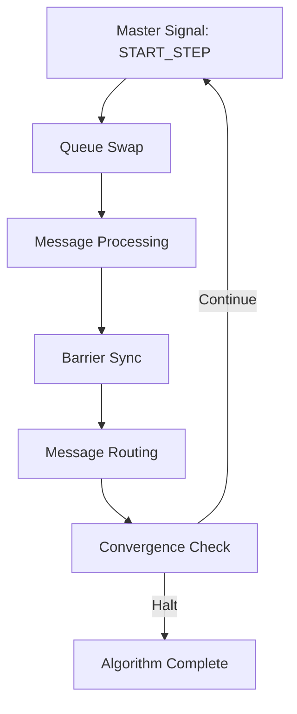

## Pregel Model Thread Simulation Framework


### Project Overview

This project implements a Pregel-style distributed graph processing framework using multi-threaded simulation. It serves as a foundational step toward building a fully distributed, multi-server implementation while providing a complete vertex-centric computing environment for educational purposes.


### Project Vision 


##### Current Phase: Thread Simulation

-  Multi-threaded simulation of distributed workers within a single JVM 

- Identical architecture to planned distributed version, only replacing network communication with thread communication 

- Proof of concept for the vertex-centric programming model


##### Next Phase: Multi-Server Distributed System

- Socket-based communication between workers across multiple machines

- Fault tolerance and recovery mechanisms

- Cluster management and dynamic scaling

---

### Pregel-Style Vertex-Centric Computing

The Pregel model, introduced by Google, provides a framework for large-scale graph processing.

#### References

- Original Paper: [Pregel: A System for Large-Scale Graph Processing](https://15799.courses.cs.cmu.edu/fall2013/static/papers/p135-malewicz.pdf) 

- Implementation Guide: [MIT Lecture Notes on Pregel](https://jshun.csail.mit.edu/6506-s23/lectures/lecture11-1.pdf)

  Core Principles:

#### Core Principles

- Vertex-Centric Computation: Each vertex independently performs computations, updates its state, and sends messages to other vertices.

- Bulk Synchronous Parallel (BSP): Computation progresses in synchronized supersteps.

- Scalability: Naturally parallel, enabling processing of millions of vertices efficiently.

- Message Passing: Vertices communicate exclusively through messages, avoiding shared state.

---

### Framework Architecture

Core Components Deep Dive


**1. Orchestration Layer** (``orchestration/``)

- ``Master``: Central coordinator managing supersteps, worker synchronization, and halting detection

- ``Worker``: Thread-based computation units, each managing a partition of vertices

- ``Router``: Handles message delivery between workers during superstep transitions

- ``Control System``: Synchronization signals (``START_STEP``, ``PROCESS_MESSAGES``, ``SHUTDOWN``)


**2. Graph Data Model** (``graph/``)

```java
// Graph Construction Example
List<List<Integer>> edges = Arrays.asList(
    Arrays.asList(0, 1),        // Edge from vertex 0 to 1
    Arrays.asList(1, 2),        // Edge from vertex 1 to 2
    Arrays.asList(2, 0)         // Edge from vertex 2 to 0
);

// Parameters: numVertices, edges, isWeighted, isDirected
Graph graph = new Graph(3, edges, false, true);
```

**Graph Model Features:**

- Vertex-centric storage: Each vertex knows only its local edges 

- Flexible edge properties: Support for directed/undirected, weighted/unweighted 

- Partitioning: Automatic vertex distribution using hash-based partitioning 

- In-memory optimized: Designed for high-performance iterative computation


**3. Computation Engine** (``computations/``, ``runners/``)

- ComputationStrategy: Interface for vertex computation logic 

- AlgorithmRunners: Initialize algorithm-specific vertex states 

- Pluggable Design: Clean separation between framework and algorithms

---

### Implementing New Algorithms: Step-by-Step Guide

 **Step 1:** Define Vertex Computation Logic

```java
public class NewAlgorithmComputation implements ComputationStrategy {
    
    @Override
    public void compute(Vertex vertex, List<Double> incomingMessages,
                       MessageEmitter emitter, int totalVertices) {
        // TODO
    }
}
```

**Step 2:** Create Algorithm Runner for Initialization

```java
public class NewAlgorithmRunner implements AlgorithmsRunner {
    private Graph graph;
    private List<Worker> workers;
    private int sourceVertex;
    
    public NewAlgorithmRunner(Graph graph, List<Worker> workers, int source) {
        this.graph = graph;
        this.workers = workers;
        this.sourceVertex = source;
    }
    
    @Override
    public void start() {
        // Initialize vertex states
        // TODO
        
        // Activate source vertex for first superstep
        // TODO
    }
    
    @Override
    public void print() {
        // Output algorithm results
        // TODO
    }
}
```

**Step 3:** Register Algorithm in Framework

```java
// In AlgorithmType.java
public enum AlgorithmType {
    
    NEW_ALGORITHM {
        @Override
        public ComputationStrategy getComputationStrategy() {
            return new NewAlgorithmComputation();
        }
        
        @Override
        public AlgorithmsRunner createAlgorithmsRunner(Graph graph,
                List<Worker> workers, int sourceVertex) {
            return new NEWAlgorithmRunner(graph, workers, sourceVertex);
        }
    },
    
    // ... existing algorithms
}
```

---

### Execution Model: Superstep Lifecycle




1. **Master Signal: START_STEP**
   - Workers prepare for computation phase
   - Master sends control signal to all workers
   - Workers transition to ready state
2. **Queue Swap**
    - Prepare for new message processing round
    -  Swap current and next message queues:
       -  ``currentQueue`` ← ``nextQueue`` (messages from previous superstep)
       - ``nextQueue`` ← ``EMPTY`` (ready for new messages)
3. **Message Processing**  
    - Execute vertex computation logic
    - Each worker processes messages for its assigned vertices
        ```
        for each vertex with messages:
            compute(vertex, messages, emitter, totalVertices)
        ```
    - Vertices update state and emit new messages
4. **Barrier Sync**
   - Ensure all workers complete before proceeding
   - Mechanism Used: CountDownLatch synchronization
   - No worker proceeds until all finish computation
5. **Message Routing**
     - Deliver messages to destination workers
     - Router scans all worker outboxes and routes messages
6. **Convergence Check**
    - Determine if algorithm should terminate
      - BFS: No new distance improvements
      - PageRank: Global rank changes below ε threshold
      - General: No messages in system

---

### Example Execution Trace:

```agsl
========== SuperStep 1 ==========
-> All workers STARTED
-> All workers FINISHED
-> Messages exist, continuing.

========== SuperStep 2 ==========
-> All workers STARTED  
-> All workers FINISHED
-> No new messages, halting.
```


### Currently Implemented Algorithms

1.  Breadth-First Search (BFS)

2. PageRank


### System Configuration

```java
// In Master.java - Adjust based on available cores
static int numberOfWorkers = 5;  // Optimal: Number of CPU cores
```


### Performance Tuning

- Graph Partitioning: Hash-based using vertexID % numberOfWorkers 

- Message Queues: ConcurrentLinkedQueue for thread-safe operations 

- Synchronization: CountDownLatch for barrier synchronization 

- Memory Management: Per-worker message queues reduce contention

---

### Basic Usage Pattern:

```java
// 1. Create graph
List<List<Integer>> edges = // edge list
Graph graph = new Graph(numVertices, edges, isWeighted, isDirected);

// 2. Choose algorithm
AlgorithmType algorithm = AlgorithmType.BFS; // or PAGERANK
        
// 3. Create and run master
Master master = new Master(graph, algorithm, sourceVertex); // source not needed for PageRank
master.start();     // Initialize algorithm state
master.run();       // Execute supersteps until convergence
master.printResults(); // Output results
```


### Limitations

- Single Machine: All workers run in one JVM 

- No Fault Tolerance: Worker failures halt computation 

- Memory Bound: Limited by single machine RAM


### In Progress Distributed Features

- Network Communication: Socket-based inter-worker messaging 

- Persistent Storage: Disk-backed vertex state for large graphs

- Dynamic Load Balancing: Runtime vertex redistribution 

- Checkpointing: Recovery from worker failures 

- Cluster Management: Automatic worker discovery and coordination


